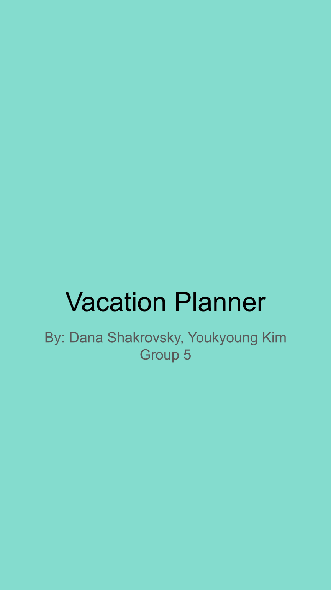
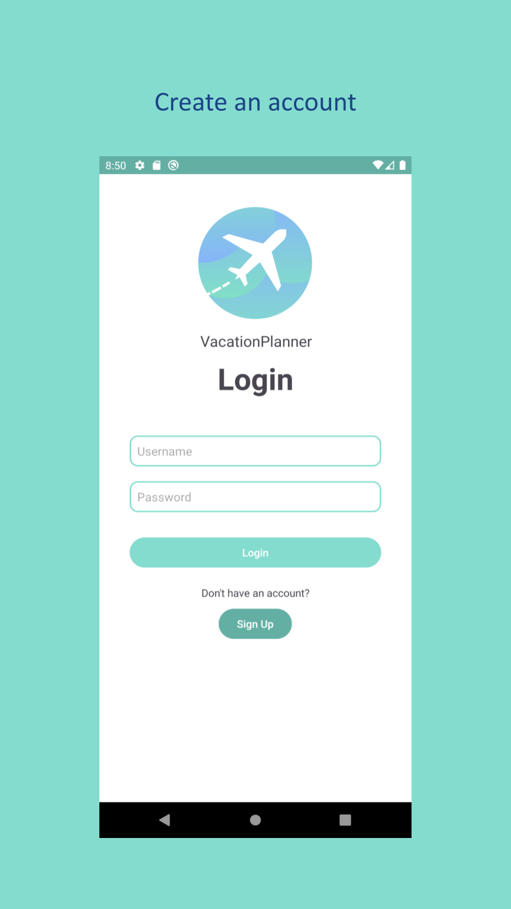
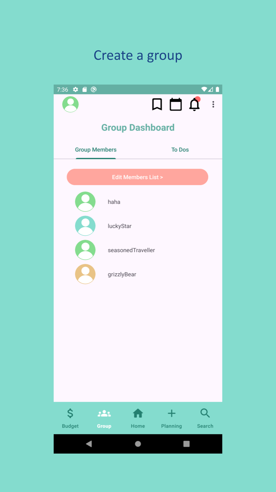
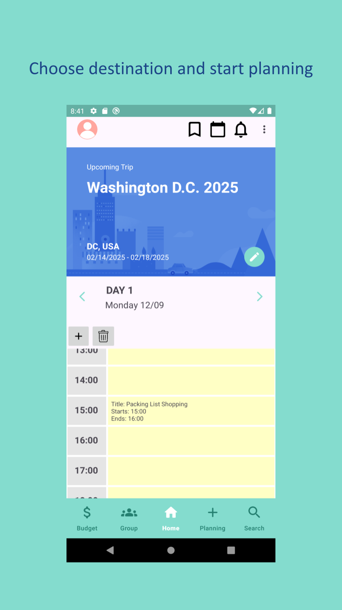
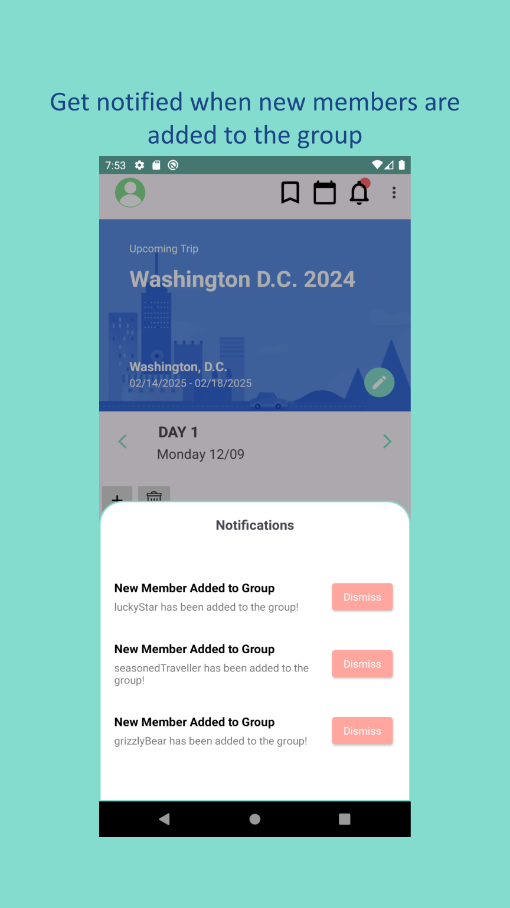
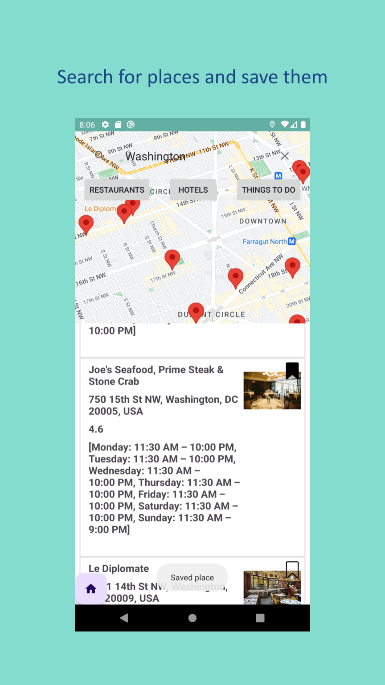
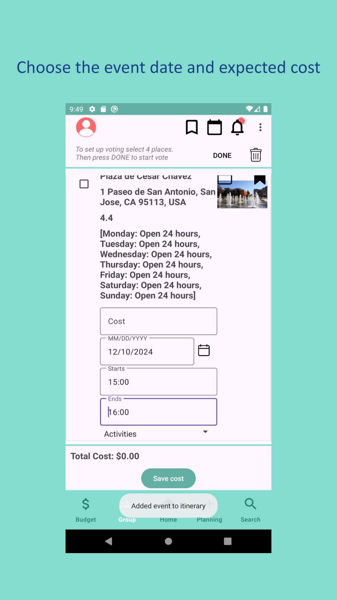
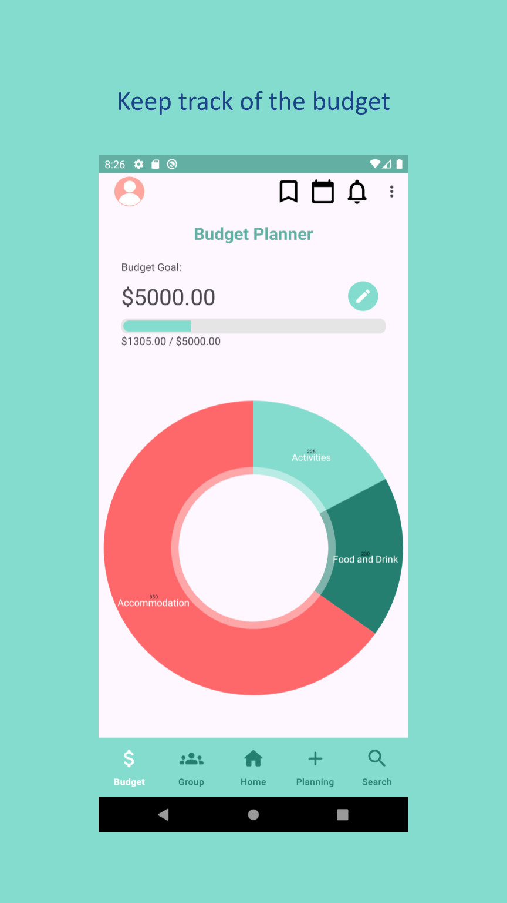
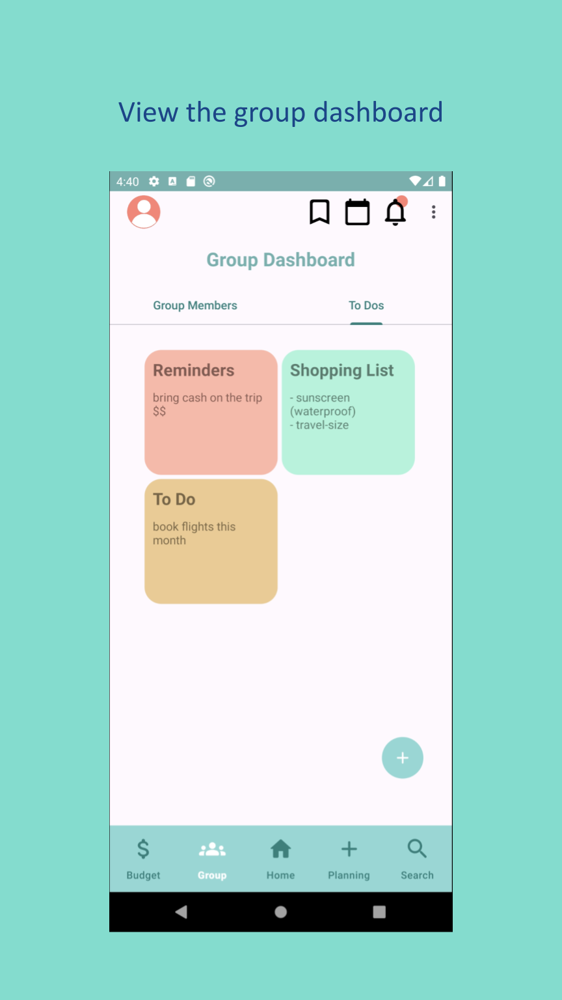

# CS 175 Final Project - Vacation Planner

## Description

Vacation Planner is an Android app designed to help users collaboratively plan trips. Users can manage itineraries, budgets, group tasks, and notifications, making travel planning simple and organized.

## APK

https://drive.google.com/file/d/1pXWFkxA5M2rx1yivchDQdRS_GZYFbMQ4/view?usp=sharing

## App Introduction

  
  
  
  
  
  
  
  
  

## Demo Video

https://youtu.be/LkZSDmTN3Lg

## Backlog

https://docs.google.com/spreadsheets/d/1fpYVnRL3AbZb8MF24ipY-xA_fWZiXZk_eyACyeAWv9c/edit?usp=sharing

## Final Report

https://docs.google.com/document/d/154DTL-21UxcNQW5Xgm-bTP1e26G688BKYL7Bu_GEnw0/edit?usp=sharing
